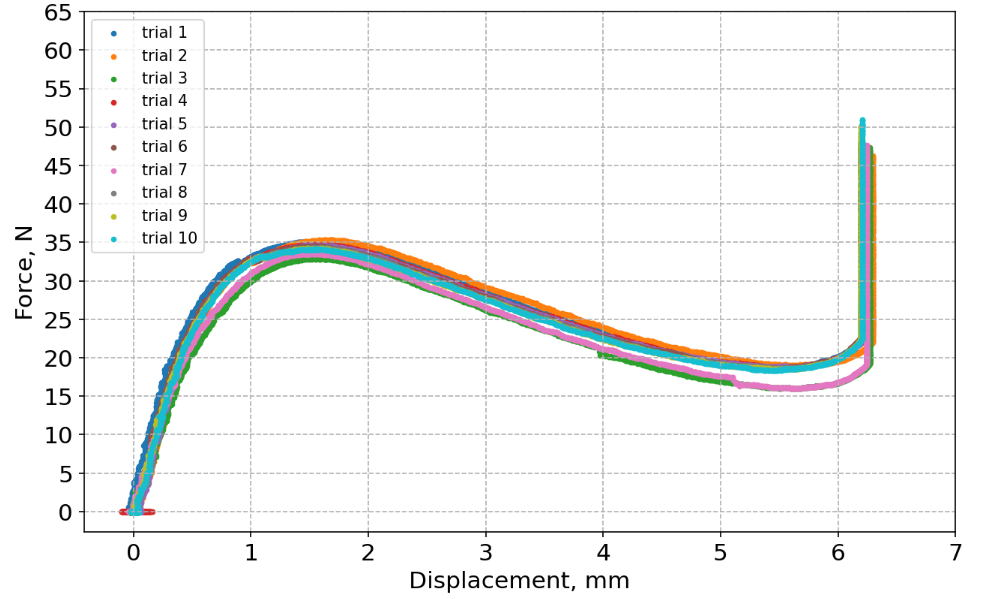

## Force-Displacement 10 trials:
```python
# skiprows = 0: don't skip any rows, [0]: skip headed(0th) row
df1 = pd.read_csv("path_to_trials/trial1.csv", skiprows = 0)
df2 = pd.read_csv("path_to_trials/trial2.csv", skiprows = 0)
df3 = pd.read_csv("path_to_trials/trial3.csv", skiprows = 0)
...
df10 = pd.read_csv("path_to_trials/trial10.csv", skiprows = 0)

fig=plt.figure(figsize=(10,6), dpi= 150, facecolor='w', edgecolor='k')
ax = fig.add_subplot(1, 1, 1)
# raw x-axis data: in rest state sensor max value, in compressed state min value
x1 = df1["top"]
x2 = df2["top"]
x3 = df3["top"]
...
x10 = df10["top"]

# need to reverse data
x1 = -(x1 - x1[1])
x2 = -(x2 - x2[1])
x3 = -(x3 - x3[1])
...
x10 = x10 = -(x10 - x10[1])

# raw y-axis data with negative force reversed to positive
force1 = -df1["fz"]
force2 = -df2["fz"]
force3 = -df3["fz"]
...
force10 = -df10["fz"]

#plotting
plt.scatter(x1[1:], force1[1:], 7, marker='o', label = "trial 1")
plt.scatter(x2[1:], force2[1:], 7, marker='o',label = "trial 2")
...
plt.scatter(x10[1:], force10[1:], 7, marker='o',label = "trial 10")
L = plt.legend(loc=2, prop={'size': 10})
major_ticksx = np.arange(0,7.5,1)
major_ticksy = np.arange(0, 70, 5)
ax.set_xticks(major_ticksx)
ax.set_yticks(major_ticksy)
ax.tick_params(axis='both', which='major', labelsize=15)
plt.grid(linestyle='dashed')
ax.set_xlabel('Displacement, mm',fontsize = 15)
ax.set_ylabel('Force, N',fontsize = 15)
#plt.savefig('figure_to_save.eps', format='eps')

```
